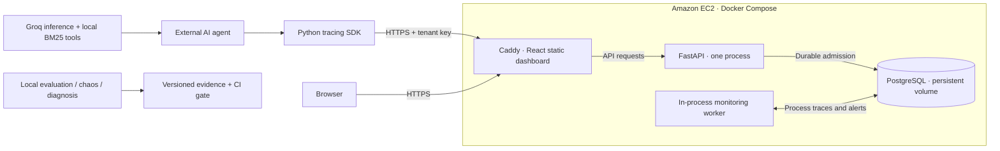

<div align="center">

# AgentGuard

**Trace the execution. Test the outcome. Verify the fix.**

Testing, observability and evaluation for multi-step AI agents.

[](https://rudraksh-agentguard.duckdns.org)
[](https://github.com/rudrakshtyagi1/agent/actions/workflows/ci.yml)
[](https://github.com/rudrakshtyagi1/agent/actions/workflows/deployment.yml)

**[Open live dashboard](https://rudraksh-agentguard.duckdns.org)** ·
[Run locally](#run-locally) · [Architecture](#architecture) ·
[Interview walkthrough](docs/INTERVIEW_DEMO.md)

</div>

## Live on AWS

AgentGuard is deployed on **Amazon EC2**, with PostgreSQL persistence and Caddy
serving the React dashboard over HTTPS.

**Live URL: https://rudraksh-agentguard.duckdns.org**

Public HTTPS readiness and dashboard delivery were verified on **September 30, 2026**.
The [readiness endpoint](https://rudraksh-agentguard.duckdns.org/ready) checks the
backend database and monitoring worker; it is not an end-to-end quality evaluation.

> **Visiting the demo:** The hosted dashboard requires a tenant monitoring key to
> view telemetry. There is no public guest credential. Run the project locally to
> explore evaluation, chaos testing and failure diagnosis without cloud credentials.
> Hosted mode exposes authenticated monitoring; unscoped local demo APIs are disabled.

## Why AgentGuard?

An agent can retrieve the wrong document, hit a tool timeout or return an incorrect
answer even when its HTTP request succeeds. A final response alone does not explain
what happened along the way.

AgentGuard records the execution journey, links checks to trace evidence and compares
agent versions. Its support-agent example follows a refund question through policy
retrieval, order lookup and answer generation. Controlled failures make recovery
behavior visible and reproducible.

## What it does

| Capability | What you can inspect |
| --- | --- |
| Execution tracing | Nested planner, model, retrieval and tool spans with timing and errors |
| Evaluation studio | Versioned task checks, citation/tool evidence and per-metric results |
| Chaos testing | Controlled timeouts, malformed results and retrieval faults with bounded retries |
| Failure diagnosis | Observed failing steps, rule-based hypotheses and similar symptoms |
| Regression gates | Paired version comparisons, slice reports and fail-closed CI checks |
| Recorded playback | Strict playback of recorded boundary responses, distinct from fresh execution |
| Live monitoring | Tenant-scoped ingestion, durable processing, retention and execution-health alerts |
| Python SDK | Explicit instrumentation with payload capture off by default |

Diagnosis distinguishes observed errors from inferred causes. Execution completion
and answer correctness are reported separately.

## Architecture



The deployment uses one EC2 server with three containers. Caddy handles HTTPS and
same-origin API routing. The API runs as a non-root user; database and API ports
remain internal to Docker. Alembic manages the schema. PostgreSQL and certificate
state use persistent volumes, with backup and restore scripts included.

No load balancer, NAT gateway, Kubernetes, Redis or vector database is required by
this deployment. It supports **one API process**, not distributed workers or HA.
AWS usage still incurs applicable compute, storage and networking charges.

| Layer | Technology |
| --- | --- |
| Dashboard | React 19, TypeScript, Vite |
| Backend | Python, FastAPI, Pydantic |
| Persistence | SQLAlchemy async, PostgreSQL; SQLite for local development |
| Schema changes | Alembic |
| Real agent | Groq model API, local BM25 retrieval, synthetic order tools |
| Deployment | AWS EC2, Docker Compose, Caddy, DuckDNS hostname |
| Verification | pytest, GitHub Actions, release gates, deployment acceptance scripts |

## Measured evidence

| Check | Recorded result | Evidence |
| --- | --- | --- |
| Backend suite | 126 tests passed locally and in Python 3.12 container | [Deployment record](docs/benchmarks/deployment-local.json) |
| Real Groq recovery | Baseline failed on injected timeout; grounded agent recovered | [Live experiments](docs/benchmarks/groq-live-validation.json) |
| Frozen synthetic holdout | 4/4 cases passed in 12 provider requests | [Holdout review](docs/benchmarks/HOLDOUT_REVIEW.md) |
| Local concurrent ingestion | 50/50 traces processed at concurrency 5 | [Deployment record](docs/benchmarks/deployment-local.json) |
| Persistence and recovery | Trace survived API restart; backup restored into an isolated database | [Deployment record](docs/benchmarks/deployment-local.json) |
| AWS public endpoint | HTTPS readiness returned ready; dashboard returned HTTP 200 | Verified September 30, 2026 |

These are small synthetic and local deployment checks, not a production accuracy or
capacity guarantee. Earlier failed experiments remain in the evidence. Holdout
labels have not been independently reviewed by a human, and the evaluated cases
are now exposed for future tuning purposes.

## Run locally

Use Python 3.11+ and Node.js 22. No model API key is needed for the offline demo.

```bash
git clone https://github.com/rudrakshtyagi1/agent.git
cd agent
python3 -m venv .venv
source .venv/bin/activate
pip install -r backend/requirements.txt -e ./sdk
make run
```

In a second terminal, from the repository root:

```bash
npm ci --prefix frontend
npm run dev --prefix frontend
```

Open **http://127.0.0.1:5173**. Run the support agent, simulate a failure and inspect
its spans. Then explore Evaluation Studio, Chaos Lab, Failure Lab and version
comparisons. Local API documentation is at **http://127.0.0.1:8000/docs**.

Local SQLite data persists in `agentguard_dev.db`. Use fixture data: local demo
APIs are unauthenticated and should not be exposed publicly.

## Try real model execution

Configure `GROQ_API_KEY` only in your private, Git-ignored `.env`, then inspect the
plan and run one bounded case:

```bash
python scripts/run_groq_support.py --dry-run
python scripts/run_groq_support.py --limit 1 --max-requests 4 --export
```

This uses real model inference with a small policy corpus and synthetic orders.
Reports record provenance, checks and reported token usage. Provider failures are
unavailable measurements, not fabricated evaluation scores.

To export to the AWS deployment, set your tenant's `AGENTGUARD_API_KEY` privately
and add `--monitor-url https://rudraksh-agentguard.duckdns.org`.
See the [real-agent guide](docs/REAL_AGENT_DEMO.md) for recovery comparisons and budgets.

## Verify and deploy

```bash
python -m pytest backend/tests -q
npm --prefix frontend run build
python scripts/check_release.py --output artifacts/release-report.json
```

The [AWS deployment guide](docs/AWS_DEPLOYMENT.md) covers provisioning, DNS/TLS,
secret configuration, migrations, acceptance, backup restoration and updates.
Deployment acceptance CI builds the containers and checks authenticated ingestion,
restart persistence, schema drift and backup restoration without calling a model API.

## Explore the implementation

| Path | Purpose |
| --- | --- |
| `frontend/` | Dashboard and evidence views |
| `backend/app/` | APIs, execution, tracing, evaluation, diagnosis and monitoring |
| `backend/migrations/` | Versioned database schema |
| `sdk/agentguard/` | Python instrumentation and export |
| `evals/` | Versioned datasets and suites |
| `examples/support_data/` | Synthetic policies and orders for the real agent |
| `scripts/` | Experiments, release gates and deployment checks |
| `infrastructure/aws/` | Frontend container and Caddy configuration |
| `docs/benchmarks/` | Recorded results and their limitations |

## Documentation

- [Technical reference: APIs and detailed workflows](docs/TECHNICAL_REFERENCE.md)
- [Manual AWS deployment and operations](docs/AWS_DEPLOYMENT.md)
- [Real Groq agent experiments](docs/REAL_AGENT_DEMO.md)
- [Interview demo and engineering tradeoffs](docs/INTERVIEW_DEMO.md)
- [Project status and remaining operational work](docs/PROJECT_STATUS.md)
- [Implementation roadmap](ROADMAP.md)

AgentGuard does not claim general hallucination detection, exact causal diagnosis,
production-scale reliability or a complete multi-user SaaS. Its focus is inspectable
execution evidence, bounded recovery and honest evaluation.
