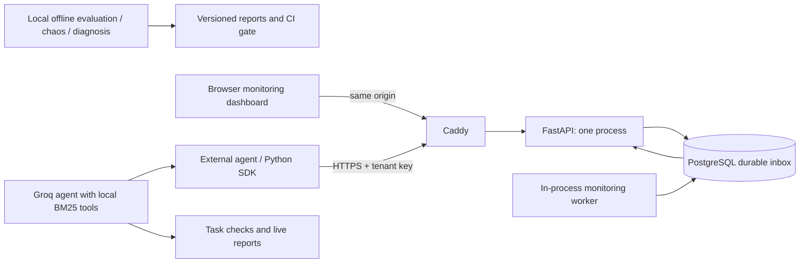

# AgentGuard interview walkthrough

## Opening (30 seconds)

“AgentGuard helps debug multi-step agents by recording nested model, retrieval and
tool spans, checking task outcomes and comparing versions. It separates an observed
failed step from a hypothesized cause, and execution health from answer correctness.”

## Five-minute demonstration

1. Start the local backend (`make run`) and frontend (`npm --prefix frontend run dev`).
   Open the trace explorer, execute the built-in support agent, then simulate a tool
   timeout. Inspect parent/child spans and the failed order lookup. Explain that this
   path is deterministic, so it can run without network credentials.
2. Use Evaluation Studio and Chaos Lab to show scored evidence and bounded retries.
   In Failure Lab, distinguish recorded errors from inferred causes. Show paired
   regression results and the fail-closed release gate.
3. In Live monitoring, open a `groq-support` trace from a real provider run. Show
   reported token usage and the model/retrieval/tool sequence. To create a fresh
   trace, use `scripts/run_groq_support.py --limit 1 --max-requests 4 --export`.
   Use `--monitor-url https://YOUR_DOMAIN` and the deployed monitoring key when
   exporting to AWS. The Groq key remains on the agent's machine.
4. Run the transient-failure comparison if quota and time permit:
   `python scripts/run_groq_support.py --compare --fault transient_tool_timeout
   --limit 1 --max-requests 8 --export`. A baseline failure makes the command exit 1
   even when grounded recovers. Show the failed attempt, retry and successful answer.
5. Open the recorded [live evidence](benchmarks/groq-live-validation.json) and
   [holdout review](benchmarks/HOLDOUT_REVIEW.md). Discuss the original turn-budget
   failure, two unsuccessful fixes and the final evidence-to-answer change. Four
   previously unrun synthetic cases passed in 12 requests on the frozen version.
   This is not a claim of perfect real-world accuracy.

If the provider is unavailable, use the saved reports and deterministic demo;
label them as recorded evidence. Do not present playback as a fresh live execution.
Do not expose the unscoped local demo APIs publicly; the AWS dashboard is monitoring-only.

## Architecture and tradeoffs

A durable inbox survives API restart; bounded admission, sampling and retention
control storage. One worker keeps coordination simple but limits scaling. PostgreSQL
and TLS state persist in volumes; verified database backups support recovery. Keys
select tenants, while payload capture is off by default. This is operator access,
not a full multi-user SaaS with signup, granular RBAC or billing.

Why BM25? The small policy corpus supports deterministic lexical retrieval and
requires no embedding service. Why deterministic checks? They provide auditable
labels/tool/citation checks; they do not pretend to measure all semantic faithfulness.
Why no autonomous root-cause claim? The first observable failure can be identified,
but its underlying cause may need external evidence.

## Defensible résumé wording

- Built AgentGuard with FastAPI, React, PostgreSQL and a Python tracing SDK to
  inspect nested agent execution, evaluate outcomes and compare versions with CI gates.
- Implemented tenant-scoped telemetry ingestion, durable processing, bounded retries,
  retention and evidence-linked monitoring alerts, with payload capture off by default.
- Validated a real Groq support agent on four synthetic holdout cases and recorded
  transient tool-failure recovery; preserved failed experiments and evaluation limits.
- Packaged a single-server AWS deployment with Docker, HTTPS configuration, Alembic
  migrations, readiness checks and verified backup restoration.

Only say “deployed on AWS” after you perform and verify the deployment. Add a public
URL afterward. Do not claim production scale, general hallucination detection, or
an independently calibrated semantic evaluator.
