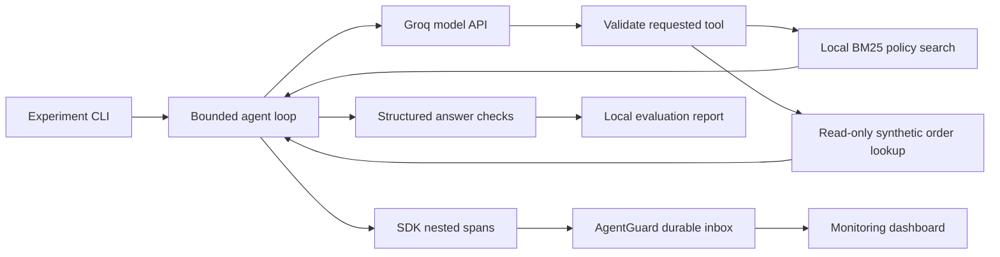

# Real Groq support agent: reproducible experiment

## Status

The real HTTP integration, local retrieval/tool orchestration and offline contract
tests are implemented. **Live provider behavior and model quality are not yet
verified.** Test responses are scripted; they are not benchmark results. A fresh
local credential is required for the first live smoke run.

The order database is synthetic. The model inference is real when you run the live
command. Retrieval uses a small local corpus with title-boosted BM25; no embedding
API, vector database, or paid retrieval service is needed. The model chooses tool
names and arguments. Only policy search and read-only access to the requested order
are allowed. No refund, shell execution, arbitrary URL fetch, or other-order access
is available.

## 1. Configure and inspect the plan

Install the existing backend requirements and SDK:

```bash
pip install -r backend/requirements.txt -e ./sdk
```

Create a free Groq account, remain on its Free plan, and put a **fresh** credential
in the repository-root `.env` as `GROQ_API_KEY=...`. If a key has been pasted into
chat or another shared surface, revoke it and replace it. The `.env` is ignored
by Git. The example never prints credentials, stores HTTP error bodies, or follows
provider redirects.

```bash
python scripts/run_groq_support.py --dry-run
```

Dry-run prints case IDs, model, dataset hash and request budget. It does not load a
key, contact Groq, or generate scores. The default model is `qwen/qwen3.8-27b`,
listed in Groq's free-plan limits when this integration was written. Models and
account limits can change: check your console and use `--model` if necessary.
The client cannot establish your account's billing tier; request budgets are not
a substitute for keeping the account on the Free plan.

Official references, checked 2026-09-29:

- [Groq model catalog](https://console.groq.com/docs/models)
- [Local tool calling](https://console.groq.com/docs/tool-use/local-tool-calling)
- [Free-plan limits](https://console.groq.com/docs/rate-limits)
- [API parameters](https://console.groq.com/docs/api-reference)

## 2. Run one real request

Start the normal AgentGuard API/dashboard, then:

```bash
python scripts/run_groq_support.py --limit 1 --max-requests 4 --export
```

The default case uses synthetic order `DEMO-001` and the grounded agent version.
Typical flow: search policy → read order → generate structured answer. The actual
sequence is selected by the model, so fewer/more calls and failures are possible.

Budgets: four agent turns, six local tool requests, at most four provider requests
by default, 512 maximum completion tokens per request, eight seconds between
requests, 20-second HTTP timeout and 100-second per-agent deadline. The complete
conversation is limited to 24,000 characters and a provider response to 64 KiB.
There is no automatic inference retry, paid fallback, or model substitution.
429, authentication, provider failure and exhausted budgets stop the experiment.

The JSON report defaults to `artifacts/groq-support-report.json` (Git-ignored).
It includes the answer, observed tools, corpus/prompt/model provenance, token usage
when supplied by Groq, failure category and deterministic checks. It excludes raw
prompts, HTTP bodies and model reasoning. **Exit 0** means every requested task
check passed, **1** means a failure/incomplete or unavailable measurement,
**2** means configuration error. Telemetry-export failure is reported separately
and does not change the agent's measured answer outcome.

For an authenticated monitoring backend, also configure `AGENTGUARD_API_KEY`
locally. This is distinct from the Groq key. `--export` sends minimized completed
traces to `http://127.0.0.1:8000` by default; `--monitor-url` changes that destination.
Inputs, outputs and metadata are omitted by the SDK. Model span timing, safe error
classes, ancestry and token fields remain observable. Detailed synthetic answers
and provenance stay in the local JSON report.

## 3. Demonstrate a failure and an actual recovery change

```bash
python scripts/run_groq_support.py --compare --fault transient_tool_timeout \
  --limit 1 --max-requests 8 --export --output artifacts/groq-recovery.json
```

Both versions receive the same input and transient order-tool failure. Baseline
has one local attempt. Grounded has two, records the first failed attempt, retries
once and then lets the model answer from the returned evidence. Grounded also
uses explicit evidence instructions and validates required lookups/citations.
The model still has to choose valid tools and produce a correct answer: recovery
is not guaranteed, and this command does not fabricate an improvement.
The comparison exits 1 when the baseline fails, even if the grounded version
passes; inspect the per-version results and improvements in its report.

Use `--fault tool_timeout` for a persistent failure that exhausts both versions,
or `--fault missing_policy` for missing evidence. Faults affect only local synthetic
tool boundaries, never the provider. Reports retain the fault and version settings.

In **Live monitoring**, find `groq-support`, open its trace and inspect the model
and tool spans. A recovered run can have a failed child span while its root completes.
Monitoring reports execution health; the local report supplies the separately
scoped answer checks.

## 4. Evaluate without overstating the result

`evals/datasets/real_support/cases.json` has two development cases and five separately
marked holdout cases. Cases include the inclusive boundary, the day after it,
final-sale exceptions, undelivered orders and unknown IDs. Labels are drafts from
our synthetic policy, **not independently reviewed**. No expected labels are passed
to the agent. Avoid tuning on holdout outputs; if you do, create a fresh holdout.

```bash
python scripts/run_groq_support.py --split dev --limit 2 --compare \
  --max-requests 12 --output artifacts/groq-dev.json
python scripts/run_groq_support.py --split holdout --limit 1 \
  --max-requests 4 --output artifacts/groq-holdout-smoke.json
```

Keep runs small on the free tier. A full five-case comparison can exceed the
maximum 12-request budget; reports explicitly mark partial comparisons. Shared
request budgets include both versions, and order alternates between cases. Do not
compare different sampled subsets as though they were paired.

Checks require completed execution, expected decision, required/retrieved citation
IDs and a lookup of the requested order. They do not establish that every sentence
is grounded. Provider failures are **unmeasured**, excluded from paired outcome
counts and cause the overall experiment to fail closed. No statistical reliability
claim should be made from this small, synthetic, single-pass dataset.

## Next steps requiring evidence or access

1. Run and record the fresh-key smoke test; inspect real provider responses.
2. Review expected labels independently and expand the corpus/cases from a real use case.
3. Record paired results without changing the holdout; document failures, not just successes.
4. Validate deployment/load behavior before a hosted demo; hosting needs account access.
5. Produce the final résumé claims and demo narration from measured results.

### Five-minute interview walkthrough

Explain the architecture below, run a successful case, inject a transient tool
failure, inspect its failed span, compare the one-attempt and two-attempt versions,
and finish with the measured report and its limitations. Do not present scripted
HTTP tests as live-model outcomes.


